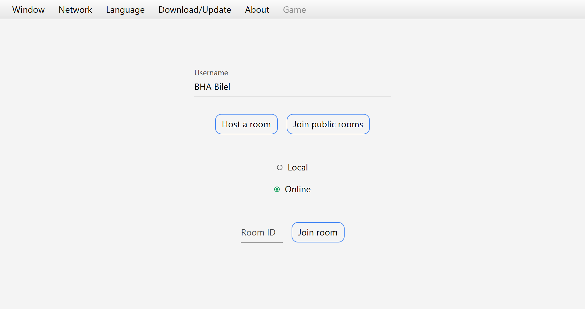

# JavaFX-XO 🕹️

> Play the famous classic TicTacToe game with your friends online!
> 
> Jump to the [Setup](#setup) section to to download the game, enjoy!
> 
> Discover [How to play](#how-to-play).
> 
> You can find 5 more board games in the [Collection](#collection) section, give them a try!

## Table of contents
* [General info](#general-info)
* [Game Charachteristics](game-charachteristics)
* [How to play](#how-to-play)
* [Setup](#setup)
* [Collection](#collection)
* [Project dependencies](#project-dependencies)
* [Additional info](#additional-info)
* [Feedback](#feedback)

## General info
This project is the first of many similar ones, so think of it as a first step to reaching a final goal.

The simplicity of this game makes it the best way to test your skills, my ultimate goal was to be able to tackle any game of this kind, and I'm quite confident that I reached that point.

## Game Charachteristics
- Turn based
- Multiplayer (no AI)
- Tabletop view (2D)
- Distributed (client/server)
- Socket programming (TCP)
- Message oriented communication (except game app)
- Supports multiple resolutions thanks to JavaFX scaling
- Supports fullscreen mode

## How to play

After connecting to the server, the main app gui is presented to the player, allowing him to enter any username, then either Host, Join a specific room through its ID, or Join public rooms.

If the player chooses to play with random people, he will be presented with a list of public rooms

After joining a **room** the player is presented with this gui, where he can start a **chat** with people already in the room, change his **name** or his **place**, and set his **ready** status; the host has in addition the ability to change the room's **privacy** to either public/private; **kick** someone, and to **start the game**; the host privileges are **passed** automatically to the next player if the host leaves the room

The game works as any other XO game but in a distributed environment, you can end the game without leaving the room using the **Return to..** menu at the top.

## Setup
Describe how to install / setup your local environement / add link to demo version.
Portable exe file in setup folder

## Collection
- XO (current)
- [Checkers](https://github.com/BHA-Bilel/JavaFX-CHECKERS)
- [Chess](https://github.com/BHA-Bilel/JavaFX-CHESS)
- [Connect4](https://github.com/BHA-Bilel/JavaFX-CONNECT4)
- [Dominoes](https://github.com/BHA-Bilel/JavaFX-DOMINOS)
- [Coinche](https://github.com/BHA-Bilel/JavaFX-COINCHE)

## Project dependencies
- **Java**-15.0.1
- **JavaFX**-11.0.2
- **controlsfx**-11.0.0
- **jfoenix**-9.0.10

## Additional info
- This project was developed intermittently due to other preoccupations, that's why I can't tell how much time it took me to complete it.
All the collection was initially developed in **Eclipse IDE** in late 2019, before I migrated to **Intellij IDEA** in 2021 to code the remaining parts while redesigning some parts to fit the new workflow model.

- This project wasn't my first nor my last experience coding in JavaFX, I'll do my best to publish other projects on my GitHub.

- **All** of the projects/repositories (so far) in my profile are produced by an **individual** effort, that I coded from **scratch**. However, I won't deny that I had to watch some Youtube tutorials to get a hint of how the logic works, for example I inspired the game logic from the tutorial below:

[JavaFX Game Tutorial: TicTacToe](https://www.youtube.com/watch?v=Uj8rPV6JbCE) by **Almas Baimagambetov** on Youtube. Check out his channel, it's focused around game dev using JavaFX and the FXGL engine.

# Feedback
What do you think of this project? leave your thoughts/recommendations !

  

